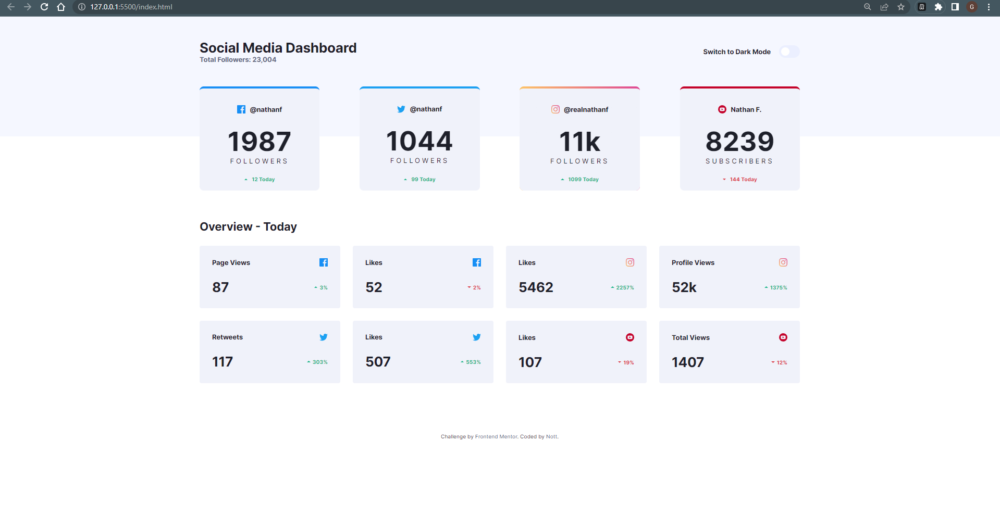
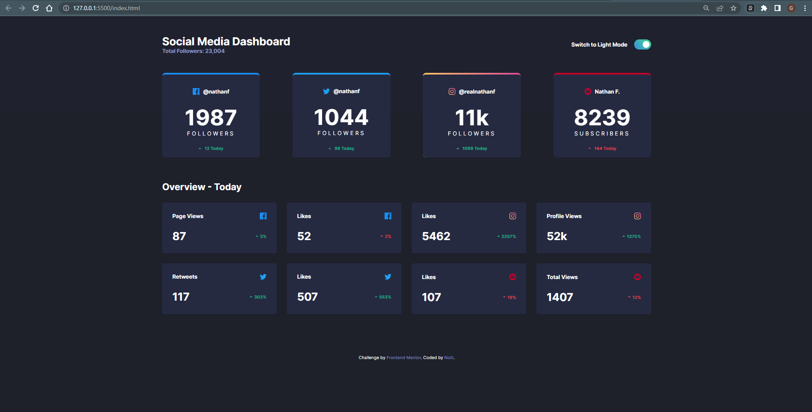
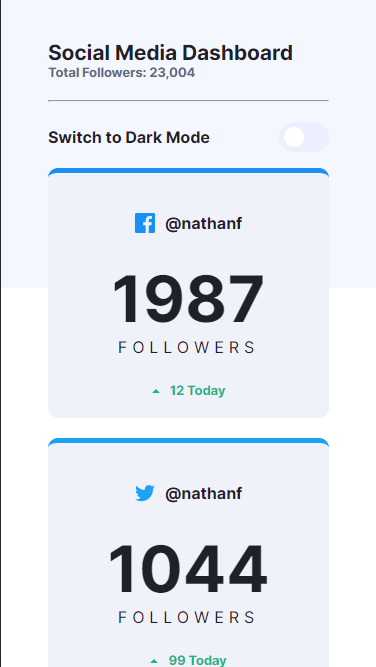
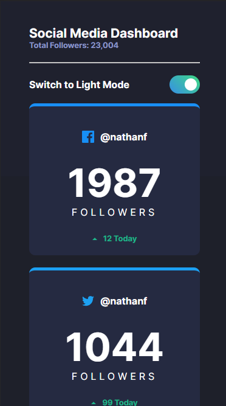

# Frontend Mentor - Social media dashboard with theme switcher

This is a solution to the [Social Media Dashboard with Theme Switcher on Frontend Mentor](https://www.frontendmentor.io/challenges/social-media-dashboard-with-theme-switcher-6oY8ozp_H). Frontend Mentor challenges help you improve your coding skills by building realistic projects. 

### The challenge

Users should be able to:

- View the optimal layout for the site depending on their device's screen size
- See hover states for all interactive elements on the page
- Toggle color theme to their preference

### Screenshot

- Desktop Design:

- Desktop Design Dark:

- Mobile Design:

- Mobile Design Dark:

### Links

- Challenge URL: [Challenge](https://www.frontendmentor.io/challenges/social-media-dashboard-with-theme-switcher-6oY8ozp_H)
- Live Site URL: [Site](https://social-media-dashboard-nott7.netlify.app/)

### Built with

- HTML5 
- CSS
- JavaScript
- Anime.js Library

## Author
- Frontend Mentor - [@nott7](https://www.frontendmentor.io/profile/nott7)
- Twitter - [@gabrynott](https://www.twitter.com/gabrynott)
- LinkedIn - [Gabriele Notonica](https://www.linkedin.com/in/gabriele-notonica-a28080253/)
